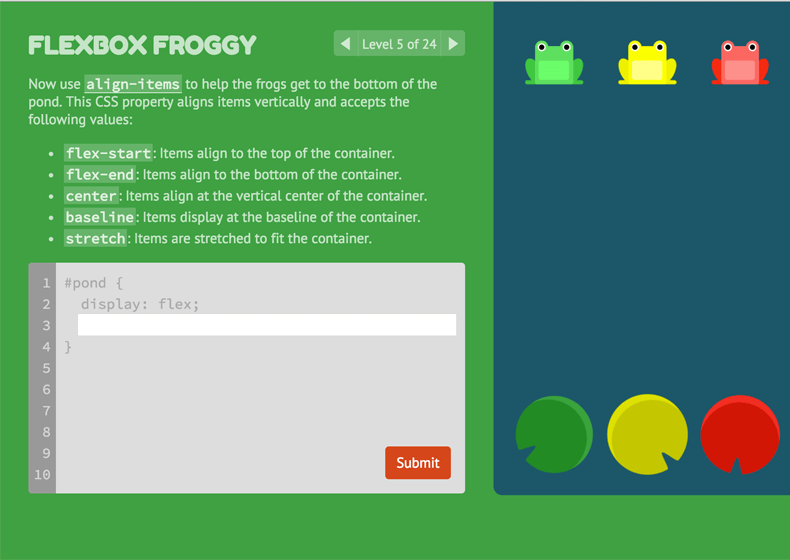

Flexbox Froggy
=======

Flexbox Froggy is a game for learning CSS flexbox. Check it out at [flexboxfroggy.com](https://flexboxfroggy.com).

Read [this blog post](https://thomaspark.co/2015/11/learning-css-layout-with-flexbox-froggy/) for background on the project.

## Author

Thomas Park

* [Twitter](https://twitter.com/thomashpark)
* [Homepage](https://thomaspark.co)
* [GitHub](https://github.com/thomaspark)

## Translators

My gratitude to these contributors for localizing Flexbox Froggy. This is what open source is all about.

* Afrikaans by [Andrea Zonnekus](https://github.com/andreazonnekus)
* Arabic by [Mahmoud Al-Omoush](https://github.com/m7modg97)
* Azerbaijani by [jalalbmnf](https://github.com/jalalbmnf)
* Bengali by [Ayemun Hossain](https://github.com/AyemunHossain)
* Bosnian by [Haris Hamzić](https://github.com/hamzic2019)
* Bulgarian by [Mihail Gaberov](https://github.com/mihailgaberov)
* Burmese by [Si Thu Hlaing](https://github.com/sithulaing)
* Catalan by [Xavier Gaya](https://github.com/xavigaya)
* Chinese Simplified by [Tim Guo](https://github.com/timguoqk)
* Chinese Traditional by [sunsheeppoplar](https://github.com/sunsheeppoplar)
* Croatian by [diomed](https://github.com/diomed)
* Danish by [Frederik Jacobsen](https://github.com/fkj)
* Dutch by [Peter Vermeulen](https://github.com/peterver)
* Czech by [Ondřej Hruška](https://github.com/MightyPork)
* Esperanto by [Harvey Stroud](https://github.com/harveystroud)
* Estonian by [Sten Orasmäe](https://github.com/sten9911)
* Farsi by [Ali Haddad](https://github.com/alihaddadkar)
* Finnish by [Minna N.](https://github.com/minna-xD)
* French by [Karl Thibault](https://github.com/Notuom)
* Galician by [Pilar Mera](https://github.com/decrecementofeliz)
* German by [Thorsten Frommen](https://github.com/tfrommen)
* Greek by [lmintmate](https://github.com/lmintmate)
* Gujarati by [Harshhh](https://github.com/ozaharsh95)
* Hebrew by [Omri Attiya](https://github.com/omriattiya)
* Hindi by [Shubham Pandey](https://github.com/shubham9411)
* Hungarian by [Adam Graf](https://github.com/netgrafe)
* Indonesian by [gabesx](https://github.com/gabesx)
* Italian by [Matteo Bandiera](https://github.com/matteobandiera)
* Japanese by [Ginpei](https://github.com/ginpei)
* Korean by [Meen Chul Kim](https://github.com/liberaliscomputing)
* Latvian by [Arturs Kirtovskis](https://github.com/akirtovskis)
* Lithuanian by [Justas Maziliauskas](https://github.com/justutiz)
* Macedonian by [David Timovski](https://github.com/davidtimovski)
* Malayalam by [Agney Menon](https://github.com/BoyWithSilverWings)
* Mongolian by [Turuu](https://github.com/TuruuDo)
* Nepali by [Kamal Ale Magar](https://github.com/KamalAle12)
* Polish by [eLGi](https://github.com/eLGi)
* Portuguese by [Marcus Tenório](https://github.com/mvtenorio)
* Romanian by [Vlad](https://github.com/pckltr)
* Russian by [Artyom Vozhzhov](https://github.com/artem328)
* Serbian by [Danko Milutinovic](https://github.com/dankoknad)
* Sinhala by [Nirmal Chamika](https://github.com/NimaChamika)
* Slovak by [Joe Henthorn](https://github.com/jjhen99)
* Spanish by [Manuel González](https://github.com/manuelitox)
* Swedish by [Martin Ohlson](https://github.com/martinkrulltott)
* Tamil by [Galeel Bhasha](https://github.com/gbhasha)
* Telugu by [Sai Venkat Balabadruni](https://github.com/Thunderbolt2-o)
* Thai by [Anurat Chapanond](https://github.com/anurat)
* Turkish by [Uğur Korfalı](https://github.com/kel-sakal-biyik)
* Ukrainian by [sHa](https://github.com/shadoll)
* Vietnamese by [Kingsten Banh](https://github.com/kingstenbanh)
* Yoruba by [Oluwafisayomi Balogun](https://github.com/oluwafisayomi-balogun)

Don't see your language on the list? Contribute a translation! Fork the [repo](https://github.com/thomaspark/flexboxfroggy/), add your translations, and submit a pull request.

## Copyright and License

Copyright 2015-2023 Thomas Park. Code released under [the MIT License](https://github.com/thomaspark/flexboxfroggy/blob/gh-pages/LICENSE). Images released under [Creative Commons](https://creativecommons.org/licenses/by/3.0/legalcode.txt).
